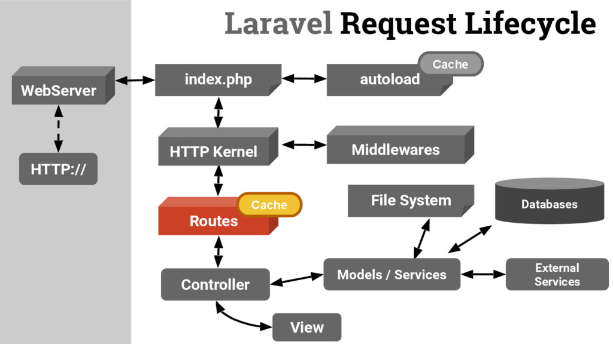

# Architecture

* 🔖 **Request**
* 🔖 **Container**
* 🔖 **Provider**
* 🔖 **Facade**

___

## 📑 Request

Cette illustration résume le trajet d'une request http.



### 🏷️ **Kernel**

Le noyau HTTP étend la classe `Illuminate\Foundation\Http\Kernel`, qui définit un tableau d'amorceurs qui seront exécutés avant l'exécution de la requête. Ces programmes d'amorçage configurent la gestion des erreurs, configurent la journalisation, détectent l'environnement de l'application et effectuent d'autres tâches qui doivent être effectuées avant que la demande ne soit réellement traitée. En règle générale, ces classes gèrent la configuration interne de Laravel dont vous n'avez pas à vous soucier.

### 🏷️ **Middlewares**

Le noyau HTTP définit également une liste d'intergiciels HTTP par lesquels toutes les requêtes doivent passer avant d'être traitées par l'application. Ces intergiciels gèrent la lecture et l'écriture de la session HTTP, déterminent si l'application est en mode maintenance, vérifient le jeton CSRF, etc. Nous en reparlerons bientôt.

### 🏷️ **Router**

L'un des fournisseurs de services les plus importants de votre application est `App\Providers\RouteServiceProvider`. Ce fournisseur de services charge les fichiers de route contenus dans le répertoire de routes de votre application.

Une fois que l'application a été démarrée et que tous les fournisseurs de services ont été enregistrés, la demande sera transmise au routeur pour expédition. Le routeur enverra la demande à une route ou à un contrôleur, et exécutera tout middleware spécifique à la route.

[Request](https://laravel.com/docs/9.x/lifecycle)

___

## 📑 Container

Le conteneur de service Laravel est un outil puissant pour gérer les dépendances de classe et effectuer l'injection de dépendances. L'injection de dépendances est une expression fantaisiste qui signifie essentiellement ceci : les dépendances de classe sont "injectées" dans la classe via le constructeur ou, dans certains cas, des méthodes "setter".

[Container](https://laravel.com/docs/9.x/container)

### 🏷️ **Zero configuration**

Si une classe n'a pas de dépendances ou ne dépend que d'autres classes concrètes (pas d'interfaces), le conteneur n'a pas besoin d'être instruit sur la façon de résoudre cette classe. Par exemple, vous pouvez placer le code suivant dans votre fichier routes/web.php :

```php 
Route::get('/', function (Service $service) {
    die(get_class($service));
});
```

> Le framework n'utilise pas vraiment l'IoC pattern et les reflectives classes, c'est un fichier de configuration hard coded.

### 🏷️ **Autre**

Il y a de nombreuses fçon de `bind` un argument, du primitif, non primitif, de la stratégie, du singleton, du typed array etc.
___

## 📑 Provider

Les fournisseurs de services sont le lieu central de tout le démarrage des applications Laravel. Votre propre application, ainsi que tous les services de base de Laravel, sont démarrés via des fournisseurs de services.

Mais qu'entend-on par "bootstrap" ? En général, nous entendons enregistrer des choses, y compris enregistrer des liaisons de conteneurs de services, des écouteurs d'événements, des intergiciels et même des routes. Les fournisseurs de services sont l'endroit central pour configurer votre application.

Si vous ouvrez le fichier config/app.php inclus avec Laravel, vous verrez un tableau de fournisseurs. Ce sont toutes les classes de fournisseur de services qui seront chargées pour votre application. Par défaut, un ensemble de fournisseurs de services principaux Laravel sont répertoriés dans ce tableau. Ces fournisseurs démarrent les composants de base de Laravel, tels que le courrier, la file d'attente, le cache et autres. Beaucoup de ces fournisseurs sont des fournisseurs "différés", ce qui signifie qu'ils ne seront pas chargés à chaque demande, mais uniquement lorsque les services qu'ils fournissent sont réellement nécessaires.

```php
'providers' => [
    // Other Service Providers
 
    App\Providers\ComposerServiceProvider::class,
],
```

Il est possible de créer ses providers.

```php
class RiakServiceProvider extends ServiceProvider
{
    public function register()
    {
        $this->app->singleton(Connection::class, function ($app) {
            return new Connection(config('riak'));
        });
    }
}
```

___

## 📑 Facade

Les façades Laravel servent de "proxies statiques" aux classes sous-jacentes dans le conteneur de services, offrant l'avantage d'une syntaxe concise et expressive tout en conservant plus de testabilité et de flexibilité que les méthodes statiques traditionnelles. C'est parfaitement bien si vous ne comprenez pas totalement comment les façades fonctionnent sous le capot - suivez simplement le courant et continuez à apprendre sur Laravel.

```php
use Illuminate\Support\Facades\Cache;
use Illuminate\Support\Facades\Route;
 
Route::get('/cache', function () {
    return Cache::get('key');
});
```

### 🏷️ **Helpers**

Pour compléter les façades, Laravel propose une variété de "fonctions d'assistance" globales qui facilitent encore plus l'interaction avec les fonctionnalités communes de Laravel. Certaines des fonctions d'assistance courantes avec lesquelles vous pouvez interagir sont `view`, `response`, `url`, `config`, etc.